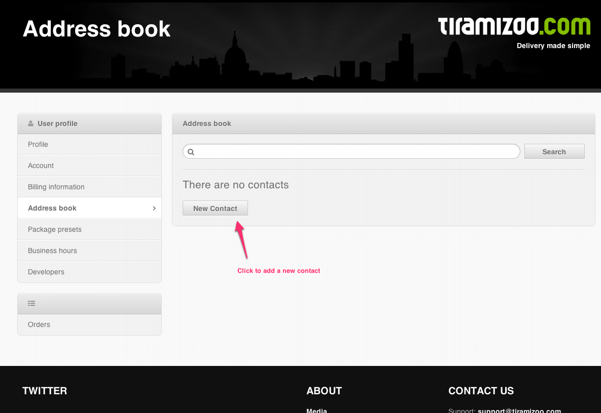
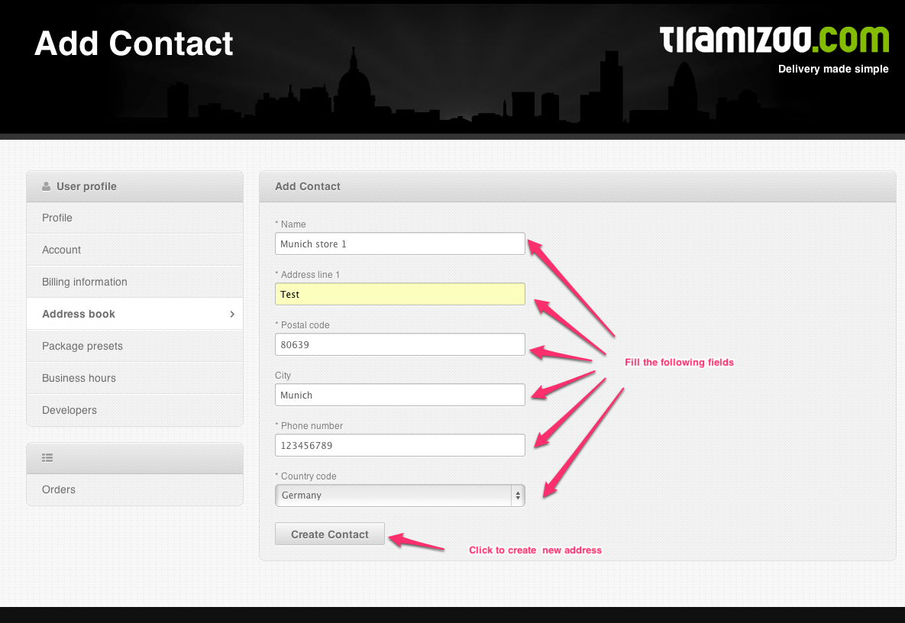
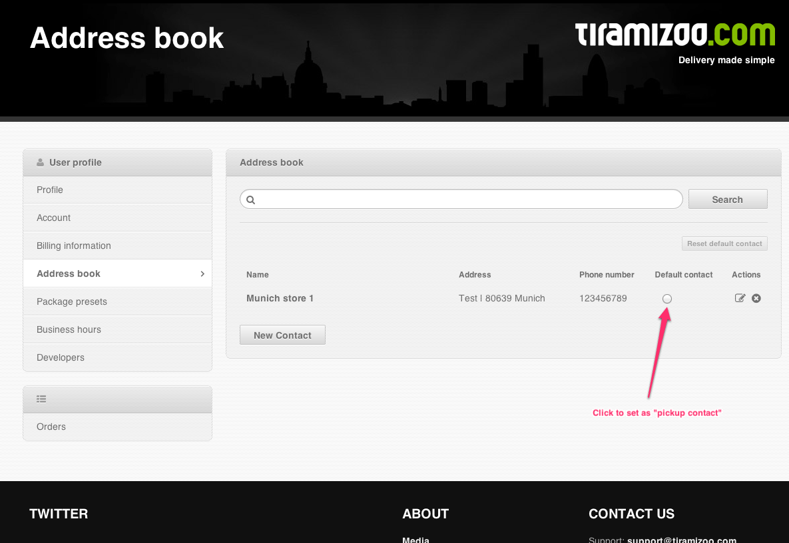

Magento Tiramizoo extension
===============

This is the Magento Tiramizoo plugin for integration with [Tiramizoo API](http://dev.tiramizoo.com/).
The module provides shipping method based on our Webservice.  It is compatible with following Magento versions: 1.7 1.8.

## Demo

-   The Demo shop is available here: http://magento-demo.tiramizoo.com
-   Admin panel access: http://magento-demo.tiramizoo.com/admin
-   Admin username: admin password: password123
-   Demo shop settings and data are reverted to default every 4h

## Prerequisites

-   Register an account on tiramizoo website (production version https://tiramizoo.com, testing version https://sandbox.tiramizoo.com)

## Installation

-   Switch to [master](https://github.com/tiramizoo/magento-plugin/tree/master) branch and download code
-   Copy all files and folders to Your Magento installations and
-   Add Tracking URL to email templates, check dist files at:
    -   locale/en_US/template/email/sales/order_new.html.dist
    -   locale/en_US/template/email/sales/order_new_guest.html.dist

    ``{{layout area="frontend" handle="sales_email_order_tiramizoo_tracking_url" order=$order}}``

-   Clear the cache.
-   Copy all files and folders to Your Magento installations and clear the cache.

## Configuration of the module

1.   **Module configuration (System -> Configuration -> Sales -> Tiramizoo)**

    - ** Is active:** Turn on/off module

    - ** API URL:** The URL of the tiramizoo service endpoint (production version https://api.tiramizoo.com/v1, testing version https://sandbox.tiramizoo.com/api/v1)

    - ** Shop URL:** URL used to build the webhook url for order creation. The Tiramizoo service will send a request to the url each time an order status change occurs.

    - ** Payment methods:** Selected payment methods which are available for tiramizoo service. Remember that “cash on delivery payment” is currently not supported by Tiramizoo.
    Packing strategy: The shop administrator is able to specify what packages are used by the shop. He can do that in 3 ways:

        - **All products have individual dimensions:** That means each product will be packed separately (number of products equals number of packages).

        - **Specific dimensions of packages:** That means that the admin is able to specify all package sizes they use in shop to pack products. Then the packing algorithm starts to pack all products in as smallest number of packages as possible and assumes the resulting package size as the package to deliver. Go to the tiramizoo website configuration to specify these dimensions (Production version, testing version).

        - **All products should fit to one package:** That means every product will go to one package (no matter how many products customer bought there will be only 1 package for courier)

    - ** Default product dimensions and weight:** Tiramizoo shipping works only if every article in shoppping cart has specified dimensions and weight. The module allows to specify global dimensions and weight. These values are applied for each product without specified dimensions and weight.

    - ** Product width/height/length mapping:** Map any magento attribute with proper dimension. Notice that magento doesn’t have specified default attributes determining product dimensions. This module creates attributes (if aren’t exists matched by code) with following codes: width, height, length.

    - ** Synchronize all retail locations:** Configuration options from all retail locations (tiramizoo accounts) are synchronized daily. This process is performed in the first http request to the shop after midnight. It is possible to synchronize configuration directly by pressing the "Synchronize" button

    - ** API Locations:** API tokens are available on the user dashboard after registration on the tiramizoo.com site. The API token is required to authenticate api requests. Module offers to connect for up to ten tiramizoo account. Shop can deliver orders from more than one retail location. The decision which api token is going to be used is made by postal codes comparisons.

    - ** Debug log:** Enable/Disable module logging

2.  **Shipping methods (System -> Configuration -> Shipping methods)**

    At Tiramizoo section it is possible to define title of Tiramizoo shipping method and prices for Immediate and Evening shipping type. You can enable and disable shipping method.

3.  **Category Edit (Catalog -> Manage Categories -> Select category -> Tiramizoo Tab)**

    - **Enable:**  You can set enable/disable Tiramizoo shipping for all products associated with selected category

    - **Packed individually:** If set to Yes it means that all products associated with selected category will be packed individually in Tiramizoo shipping

    - **Weight and dimesnions:** These attributes will apply to all products associated with selected category and will not have dimensions specified explicitly.

    All Product's category and all its parents categories need to have Tiramizoo service enabled (or inherited) to let containing products be delivered by Tiramizoo service.

    Also dimensions form enables to specify default product dimensions which will apply to all products which have the category selected and will not have dimensions specified explicitly.

4.  **Product Edit (Catalog -> Manage Products -> Click on Product -> Tiramizoo Tab)**

    - **Enable:**  You can enable/disable selected product for Tiramizoo shipping

    - **Packed individually:** If set to Yes it means that product will be packed individually in Tiramizoo delivery

    - **Weight and dimesnions:** It should be appear on General Tab

    This page contains preview of the effective dimensions

## Configure the account (retail location) ##

The main configuration of tiramizoo delivery is available on the tiramizoo website.

-   **Packages presets:** (Profile -> Default packages sizes)
    Retail location admin is able to specify package sizes that they use to pack products.

-   **Pickup contact:**

    Go to **Profile -> Account** and click on "New Contact" link

    

    Fill the required form fields and press the "Create contact" button

    

    Click on radio button to set selected contact as "Pickup contact"

    

-   **Enable Immediate delivery type:** (Profile -> Account -> Immediate time window enabled)
    Select Yes to enable Immediate delivery type or no to disable.

-   **Enable Evening delivery type:** (Profile -> Account -> Time window preset)
    Select time window to enable Evening delivery type or left blank to disable.

-   **Business hours:** (Profile -> Account -> Business hours)
    Specify when courier can pick up delivery. Selected days and hours could be extended by special days *e.g. 24/12/2013 8:00-14:00* (in this example business hours are reduced).

## Minimal configurations and rules ##

The tiramizoo shipping method is only available if the following rules are met:

-   **Tiramizoo account configuration:**
    -   Pickup contact is selected and has valid postal code
    -   Immediate delivery type or Evening delivery type is enabled
    -   Package presets are specified if shop use "Specific dimensions of packages" as packing strategy

-   **Magento configuration:**
    -   Shipping method is enabled
    -   Immediate and evening delivery have defined prices
    -   Module is enabled in Tiramizoo config
    -   Shop url is not empty
    -   One or more available payment method are selected
    -   The API Token (retail location) is added
    -   Magento Cron Job is running every 5 minutes

-   **Configuration of products in cart:**
    -   Product has specified dimensions and weight directly or inherited by global / category settings.
    -   Product is enabled with Tiramizoo Delivery
    -   Product's associated categories and its parent categories are enabled with Tiramizoo Delivery

-   **Delivery address and ordering date time:**
    -   Customer's postal code matches to the retail location's area Service coverage
    -   Current date time should be fit with Tiramizoo open hours in specified area and shop business hours

## Additional features / Tips / Limitations##

-   **WebHook notifications**

    The modules is able to receive push notification sent by tiramizoo each time the order status has changed. The order state is then changed on shop level as well. Go to Order tab to check the current order status. Webhook url needs to be accessible for POST request.

-   **Disable tiramizoo service for individual product**

    Available on product page

-   **Mark individual product to not be packed with others - standalone**

    Available on product page

-   **Disable tiramizoo service for individual category**

    Available on category page

-   **Mark each product within category as individual product to not be packed with others - standalone**

    Available on category page

-   **Multishipping checkout**

    Tiramizoo is not available on multishipping checkout

-   **Multistore support**

    Yes

## Troubleshooting and bugs ##

-   Check "Minimal configurations" section of this document
-   Use the newest version of plugin from [master branch](https://github.com/tiramizoo/magento-plugin/tree/master) and Your eShop version is 4.7.x/5.0.x.
-   In case of any issues or suggestions please let us know through [github issues](https://github.com/tiramizoo/magento-plugin/issues)

